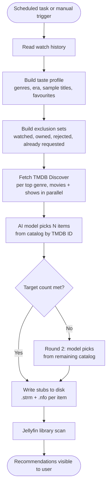

# Jellyfin.Plugin.AIRecommendations

> **Work in progress.** Early preview, not production-ready. Expect breaking changes.

Jellyfin plugin that generates per-user movie and TV recommendation libraries from watch history. Each user gets two private libraries ("AI Movie Picks" and "AI Show Picks") that appear on all their Jellyfin clients. Other users cannot see them.

Requires Jellyfin **10.11.9**.

---

## Install

Add this repository URL in **Dashboard > Plugins > Repositories**:

```
https://raw.githubusercontent.com/aG00Dtime/Jellyfin.Plugin.AIRecommendations/main/manifest.json
```

Then install **AI Recommendations (WIP)** from the catalog and restart Jellyfin.

**Manual install:** Download `Jellyfin.Plugin.AIRecommendations.zip` from [Releases](https://github.com/aG00Dtime/Jellyfin.Plugin.AIRecommendations/releases) and extract it into your Jellyfin plugins folder, then restart.

---

## Setup

1. Open **Dashboard > Plugins > AI Recommendations**.
2. Select an AI model provider and paste in your API key.
3. Paste in a [TMDB API key](https://www.themoviedb.org/settings/api) (free account required).
4. Optionally fill in a Jellyseerr URL and API key (see below).
5. Click **Save**.
6. Go to **Dashboard > Scheduled Tasks** and run **AI Recommendations Sync** to generate the first batch.

Each user gets two libraries created automatically on the first sync.

---

## AI model providers

| Provider | Notes |
|---|---|
| **OpenAI** | Default model: `gpt-4o-mini`. Costs around $0.001 per sync per user. |
| **OpenRouter** | Default model: `openai/gpt-4o-mini`. One API key for many models. |
| **Ollama (local)** | Free, runs on your own hardware. Default URL: `http://localhost:11434`. |
| **Ollama (cloud)** | Set Deployment to Cloud, base URL `https://ollama.com`, API key from ollama.com. |

Use the **Test Connection** button to verify credentials before saving.

**Ollama cloud models** (use the exact tag from ollama.com/models):

- `gemma3:27b` - good quality, free tier
- `gemma3:4b` - faster, free tier
- `gpt-oss:20b` - free tier

---

## Jellyseerr integration

When configured, hearting a recommendation stub immediately submits a download request to Jellyseerr on the user's behalf. No sync needed.

Get your API key from your Jellyseerr profile page (top-right avatar > API Key tab).

---

## Settings

| Setting | Default | Description |
|---|---|---|
| Content language | `en` | Filters recommendations to content originally produced in this language. Use any ISO 639-1 code, or leave blank for all languages. |
| Max recommendations per type | 10 | How many movie stubs and how many show stubs to maintain per user. |
| Sync interval (hours) | 24 | How often recommendations refresh automatically. |
| Limit shows to Season 1 | on | Only creates a Season 1 stub per show. Speeds up library scans. |
| Always refresh recommendations | off | When on, all stubs are replaced on every sync instead of accumulating. |

---

## User actions

Once stubs appear in your library you have two options:

| Action | What happens |
|---|---|
| **Heart / Favourite** | Submits a Jellyseerr download request immediately. The stub is removed from the AI library on the next sync. |
| **Mark as watched** | Permanently dismisses the item. The stub is deleted right away and the title will never be suggested again. |

Both actions take effect immediately without waiting for a sync.

---

## How it works

### Recommendation loop



### Taste profile

The plugin reads each user's watch history and builds a compact profile:

| Field | Description |
|---|---|
| Top genres | Up to 6 genres ranked by play count |
| Era preference | "mostly modern", "mix of classic and modern", or "mostly classic (pre-2000s)" |
| Movie/show ratio | Percentage of watch history that is movies vs series |
| Sample titles | 8 titles sampled evenly across watch history |
| Favourites | Up to 5 items the user has marked as a favourite |

### TMDB catalog

Instead of asking the AI model to invent titles from memory, the plugin fetches real candidates from TMDB Discover first. It queries each of the user's top genres (movies and shows in parallel), collects up to 10 results per genre sorted by popularity, filters out anything already watched or owned, and sends that list to the model. The model picks from the list by TMDB ID. Because every item is a real TMDB entry, results are accurate and up to date.

### Stubs

Each recommendation is written as a folder with a `.strm` file and a `.nfo` file. Jellyfin reads the TMDB ID from the folder name and fetches full artwork, cast, ratings, and descriptions automatically. The `.strm` files point to a JustWatch search URL and are not playable.

---

## Admin API

| Method | Path | Description |
|---|---|---|
| `GET` | `/AIRecommendations/Status` | Last sync time and status message |
| `POST` | `/AIRecommendations/Sync` | Trigger sync for all users |
| `POST` | `/AIRecommendations/Sync/{userId}` | Trigger sync for one user |
| `GET` | `/AIRecommendations/Users` | List users and stub counts |
| `GET` | `/AIRecommendations/Recommendations/{userId}` | List stubs on disk for a user |
| `POST` | `/AIRecommendations/Dismiss/{userId}/{tmdbId}` | Permanently reject a TMDB ID |
| `POST` | `/AIRecommendations/Clear` | Delete all stubs and reset state for all users |
| `POST` | `/AIRecommendations/Clear/{userId}` | Delete all stubs and reset state for one user |
| `POST` | `/AIRecommendations/TestProvider` | Test AI model provider connection |

All endpoints require admin authentication.

---

For build instructions and development notes, see [DEVELOPMENT.md](DEVELOPMENT.md).
