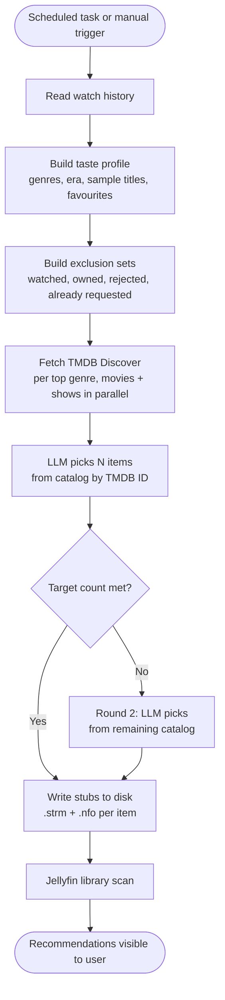

# Jellyfin.Plugin.AIRecommendations

> **Work in progress.** Early preview, not production-ready. Expect breaking changes.

Jellyfin plugin that generates per-user movie and TV recommendation libraries from watch history. Each user gets two private libraries ("AI Movie Picks" and "AI Show Picks") that appear on all their Jellyfin clients. Other users cannot see them.

Requires Jellyfin **10.11.9**.

---

## Install

### From the plugin catalog

Add this repository URL in **Dashboard > Plugins > Repositories**:

```
https://raw.githubusercontent.com/aG00Dtime/Jellyfin.Plugin.AIRecommendations/main/manifest.json
```

Then install **AI Recommendations (WIP)** from the catalog.

### Manual install

Download `Jellyfin.Plugin.AIRecommendations.zip` from [Releases](https://github.com/aG00Dtime/Jellyfin.Plugin.AIRecommendations/releases) and extract it into your Jellyfin plugins folder.

---

## Quick start

1. Open **Dashboard > Plugins > AI Recommendations**.
2. Select an LLM provider and paste in your API key.
3. Paste in a [TMDB API key](https://www.themoviedb.org/settings/api) (free).
4. (Optional) Fill in Jellyseerr URL and API key if you want request management.
5. Click **Save**.
6. Go to **Dashboard > Scheduled Tasks** and run **AI Recommendations Sync**.

Each user gets two libraries created automatically on first sync. Recommendations show up in Jellyfin like any other library item, with full artwork, cast, and ratings fetched from TMDB.

---

## How it works

### Overview

The plugin runs a sync for every enabled user. For each user it:

1. Reads their watch history and builds a compact taste profile.
2. Fetches real candidates from TMDB Discover based on their top genres.
3. Sends those candidates to an LLM and asks it to pick the best matches.
4. Writes the picks as stub files that Jellyfin scans and displays as library items.

### Recommendation loop



### Taste profile

Before calling the LLM, the plugin reads the user's watch history and compiles:

| Field | Description |
|---|---|
| Top genres | Up to 6 genres ranked by play count |
| Era preference | "mostly modern", "mix of classic and modern", or "mostly classic (pre-2000s)" |
| Movie/show ratio | Percentage of watch history that is movies vs series |
| Sample titles | 8 titles sampled evenly across watch history |
| Favourites | Up to 5 items the user has marked as a favourite in Jellyfin |

This profile is what gets sent to the LLM rather than a raw list of every item watched.

### TMDB Discover catalog (RAG)

Instead of asking the LLM to invent titles from memory, the plugin pre-fetches real candidates from TMDB first:

- Calls the TMDB Discover endpoint for each of the user's top genres (movies and shows separately, in parallel).
- Fetches up to 10 results per genre, sorted by popularity, filtered by the configured content language (default: English).
- Deduplicates and excludes anything already watched, owned, rejected, or requested.
- Passes the resulting catalog to the LLM.

The LLM then picks from that catalog by TMDB ID. Because every item in the catalog is a real, current TMDB entry, there is no need to verify titles against TMDB after the fact.

If the catalog is too small to fill the target count, the engine falls back to a free-form prompt where the LLM suggests titles by name, which are then verified against TMDB.

### What the LLM receives (catalog mode)

```
Choose exactly N items from the CATALOG below that best match the user's taste.
Use the exact tmdbId values from the catalog. Return ONLY valid JSON.

TASTE PROFILE:
Genres: Action (34), Drama (28), Sci-Fi (19), Thriller (12), Comedy (8), Animation (5)
Era preference: mostly modern (2000s-2020s)
Content mix: 60% movies, 40% series
Enjoys: Inception, Breaking Bad, The Witcher, Dune, Severance
Favourites: Interstellar, The Wire

SKIP items matching these already-seen titles:
Movie A, Movie B, Show C, ...

CATALOG:
[{"tmdbId":155,"title":"The Dark Knight","year":2008,"type":"movie","overview":"..."},
 {"tmdbId":1396,"title":"Breaking Bad","year":2008,"type":"series","overview":"..."},
 ...]

JSON: {"recommendations":[{"tmdbId":155,"title":"...","year":2008,"type":"movie","reason":"one line why"}]}
```

### Exclusion sets

Before fetching the catalog the plugin builds three exclusion sets to make sure the LLM never suggests something the user already has:

- **Watched**: TMDB IDs of every played movie, plus every series with at least one played episode (partial watches are included).
- **Owned**: TMDB IDs of every real item in the Jellyfin library, excluding the AI stub folders themselves.
- **Rejected / Requested**: IDs the user has permanently dismissed or already requested.

### Stub files

Each recommendation is written as a folder containing a `.strm` file and a `.nfo` file:

```
virtual/{userId}/movies/{Title} ({Year}) [tmdbid-{id}]/
    {Title} ({Year}) [tmdbid-{id}].strm
    {Title} ({Year}) [tmdbid-{id}].nfo

virtual/{userId}/shows/{Title} [tmdbid-{id}]/
    tvshow.nfo
    Season 1/{Title} - S01E01 [tmdbid-{id}].strm
```

Jellyfin reads the TMDB ID from the folder name and fetches full artwork, cast, ratings, and descriptions automatically. The `.strm` files point to a JustWatch search URL and are not meant to be played.

Stubs accumulate up to 50 per type. On each sync, only stubs for rejected or requested items are removed. Everything else stays until the user acts on it.

### Per-user visibility

After provisioning, the plugin adjusts each user's library permissions so they only see their own AI libraries. Users who had "enable all folders" turned on are switched to an explicit allowlist that excludes other users' AI folders.

---

## User actions

Once stubs appear in Jellyfin, users have two actions:

| Action | What happens |
|---|---|
| **Heart / Favourite** | Submits a Jellyseerr download request immediately (no waiting for the next sync). The stub is removed from the AI library on the next sync. |
| **Mark as watched** | Permanently dismisses the item. It is added to the reject list immediately and the stub is deleted. It will never be suggested again. |

Both actions are handled by a background service (`FavouriteWatcher`) that listens to Jellyfin's `UserDataSaved` event. The response is immediate and does not require a sync.

If a download completes and the real file is added to the Jellyfin library, the corresponding stub is automatically removed on the next sync.

---

## Jellyseerr integration

When a user hearts a recommendation stub:

1. The plugin looks up the TMDB ID and submits a request to Jellyseerr using the user's account.
2. The TMDB ID is added to the "requested" list so it will not be suggested again.
3. The heart is removed so the item does not appear in the user's Favourites section.

Set up Jellyseerr in the plugin config page. Get your API key from your Jellyseerr profile page.

---

## Configuration

Open **Dashboard > Plugins > AI Recommendations** to access all settings.

### LLM providers

| Provider | Notes |
|---|---|
| **OpenAI** | Default model: `gpt-4o-mini`. Costs around $0.001 per sync per user. |
| **OpenRouter** | Default model: `openai/gpt-4o-mini`. Lets you use many models under one API key. |
| **Ollama (local)** | Default base URL: `http://localhost:11434`. Free, runs on your hardware. |
| **Ollama (cloud)** | Set Deployment to Cloud, base URL `https://ollama.com`, API key from ollama.com. |

Use the **Test Connection** button on each provider section to verify your credentials before saving.

**Ollama cloud model names** (use the exact tag from ollama.com/models):
- `gemma3:27b` - good quality, free tier
- `gemma3:4b` - faster, free tier
- `gpt-oss:20b` - free tier

### Key settings

| Setting | Default | Description |
|---|---|---|
| Content language | `en` | ISO 639-1 code. Filters TMDB Discover to content originally produced in this language. Leave blank for all languages. |
| Max recommendations per type | 10 | How many movie stubs and how many show stubs to maintain per user. |
| Sync interval (hours) | 24 | How often the scheduled task runs automatically. |
| Limit shows to Season 1 | on | Only writes a Season 1 stub. Speeds up library scans. |
| Always refresh recommendations | off | When on, all existing stubs are replaced on every sync instead of accumulating. |

---

## Admin API

All endpoints require admin authentication.

| Method | Path | Description |
|---|---|---|
| `GET` | `/AIRecommendations/Status` | Last sync time and status message |
| `POST` | `/AIRecommendations/Sync` | Trigger sync for all users |
| `POST` | `/AIRecommendations/Sync/{userId}` | Trigger sync for one user |
| `GET` | `/AIRecommendations/Users` | List users and their stub counts |
| `GET` | `/AIRecommendations/Recommendations/{userId}` | List stubs currently on disk for a user |
| `POST` | `/AIRecommendations/Dismiss/{userId}/{tmdbId}` | Permanently reject a TMDB ID and delete its stub |
| `POST` | `/AIRecommendations/Clear` | Delete all stubs and reset state for all users |
| `POST` | `/AIRecommendations/Clear/{userId}` | Delete all stubs and reset state for one user |
| `POST` | `/AIRecommendations/TestProvider` | Test LLM provider connection |

---

## Build

```powershell
.\build.ps1
```

Linux/macOS:

```sh
./build.sh
```

## Releases

Every push to `main` runs the pre-push hook, which bumps the patch version, commits it, and pushes a `v1.0.x` tag. The tag triggers the GitHub Actions release workflow, which:

1. Builds the release ZIP on a clean Ubuntu runner.
2. Computes the MD5 checksum.
3. Creates a GitHub Release with the ZIP attached.
4. Updates `manifest.json` on `main` with the real checksum.

## Git hooks

```powershell
.\scripts\setup-hooks.ps1
```

- **pre-push**: bumps patch version in `VERSION.txt` and `.csproj`, adds a manifest entry, commits, and pushes the version tag.
- **pre-commit**: checks that `VERSION.txt`, `AssemblyVersion`, and `manifest.json` all have the same version number.

Skip the version bump for one push: `$env:SKIP_VERSION_BUMP=1; git push`

Manual version bump: `.\scripts\bump-version.ps1 -Part minor`
